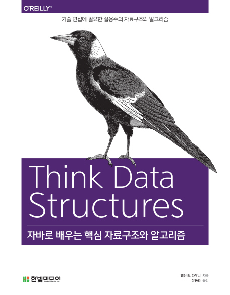

# Java Collection Framework

이곳은 JCF의 학습을 위한 저장소입니다. 아래의 책을 참고하여 실습을 진행했습니다.

<a href = "https://digital.kyobobook.co.kr/digital/ebook/ebookDetail.ink?barcode=4801162240848#"> </a>

## 2 - 알고리즘 분석

### MyArrayList 구현하기

#### 생성자

```java
public class MyArrayList<T> implements List<T> {
    int size;
    private T[] array;

    public MyArrayList() {
        array = (T[]) new Object[10];
        size = 0;
    }
}
```

자바는 타입 파라미터로 배열을 초기화 할 수 없다.
그래서 위와 같이 Object[10] 형태의 배열을 만든 뒤 (T[])로 형변환을 한다.

#### add (before)

```java
public class MyArrayList<T> implements List<T> {
    int size;
    private T[] array;

    @Override
    public boolean add(T element) {
        array[size] = element;
        size++;
        return true;
    }
}
```
여기서 문제. size의 크기가 array의 크기를 초과하는경우를 고려하지 못함.

#### add (after)

```java
public class MyArrayList<T> implements List<T> {
    int size;
    private T[] array;

    @Override
    @SuppressWarnings("unchecked")
    public boolean add(T element) {
        if (size >= array.length) {
            T[] largerArr = (T[]) new Object[array.length + 10];
            System.arraycopy(array, 0, largerArr, 0, array.length);
            array = largerArr;
        }
        array[size] = element;
        size++;
        return true;
    }
}
```
array의 크기를 고려한 add 메소드 구현

#### indexOf (before)

```java
public class MyArrayList<T> implements List<T> {
    int size;
    private T[] array;

    @Override
    public int indexOf(Object target) {
        int index = 0;
        for (T t : array) {
            if (Objects.equals(t, target)) {
                return index;
            }
            index++;
        }
        return -1;
    }
}
```

다음의 테스트코드 중 세 번째 assertion에서 에러 발생

```java
public class MyArrayListTest {

    protected List<Integer> mylist;
    protected List<Integer> list;

    @Test
    public void testContains() {
        assertThat(mylist.contains(1), equalTo(true));
        assertThat(mylist.contains(4), equalTo(false));
        assertThat(mylist.contains(null), equalTo(false));
        mylist.add(null);
        assertThat(mylist.contains(null), equalTo(true));
    }
}
```

why? contains 메소드는 indexOf 메소드를 사용한다.

배열 초기화시 size 이상의 값들은 null로 할당된다. for each 문을 사용한다면 반드시 null 포함될 수밖에 없다.

#### indexOf (after)
```java
public class MyArrayList<T> implements List<T> {
    int size;
    private T[] array;

    @Override
    public int indexOf(Object target) {
        for (int i = 0; i < size; i++) {
            if (Objects.equals(array[i]
                , target)) {
                return i;
            }
        }
        return -1;
    }
}
```


#### set (before)

```java
public class MyArrayList<T> implements List<T> {
    int size;
    private T[] array;

    @Override
    public T set(int index, T element) {
        if (index < 0 || index > size) {
            throw new IndexOutOfBoundsException();
        }

        T previous = get(index);
        array[index] = element;
        return previous;
    }
}
```

#### remove

```java
public class MyArrayList<T> implements List<T> {
    int size;
    private T[] array;

    @Override
    public T remove(int index) {
        if (index < 0 || index > size) {
            throw new IndexOutOfBoundsException();
        }

        T previous = get(index);
        for (int i = index; i < size - 1; i++) {
            array[i] = array[i + 1];
        }
        size--;

        return previous;
    }

}
```